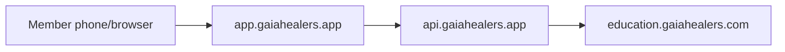

# Gaia Healers App Domain Setup (`gaiahealers.app`)

This guide connects **gaiahealers.app** to the mobile web app in this repo and prepares the path to native iOS/Android builds later.

## Architecture

| URL | Role | Host |
| --- | --- | --- |
| `https://app.gaiahealers.app` | Mobile web app (this repo) | GitHub Pages |
| `https://api.gaiahealers.app` | Backend API proxy (GHL, voice, auth) | Your server (today: same host as `ba2ki.com/gaia-proxy`) |
| `https://education.gaiahealers.com` | GHL member portal (courses, login) | GoHighLevel |
| `https://crm.gaiahealers.com` | GHL CRM + embedded app menu | GoHighLevel |
| `https://gaiahealers.com` | Public marketing site | Existing site |



**Why two domains for the app?**

- `app.*` serves static HTML/JS/CSS from GitHub Pages (free, auto-deploy on push to `main`).
- `api.*` holds secrets (GHL tokens, AI keys) in the staging proxy — never in the public repo.

---

## Phase 1 — Connect the app domain (do this first)

### Step 1: GitHub Pages custom domain

The repo already includes `CNAME` with `app.gaiahealers.app`.

1. Open GitHub → **gaiagitshare/gaia-healers-mobile-app** → **Settings** → **Pages**.
2. Under **Custom domain**, enter: `app.gaiahealers.app`
3. Wait for DNS check, then enable **Enforce HTTPS**.

### Step 2: DNS at your registrar (gaiahealers.app)

Add this record:

| Type | Name | Value |
| --- | --- | --- |
| `CNAME` | `app` | `gaiagitshare.github.io` |

Optional — send apex traffic to the app:

| Type | Name | Value |
| --- | --- | --- |
| `CNAME` or redirect | `@` | `app.gaiahealers.app` |

> Some registrars only allow apex redirect (not CNAME). Use their “forward `gaiahealers.app` → `https://app.gaiahealers.app`” tool if needed.

DNS can take 5–60 minutes. Test:

```bash
curl -I https://app.gaiahealers.app/home.html
```

### Step 3: Allow the new origin on the API proxy

On the server that runs `staging-proxy/` (currently `ba2ki.com`), update environment variables and restart:

```env
APP_PUBLIC_URL=https://app.gaiahealers.app/home.html
PROXY_PUBLIC_URL=https://api.gaiahealers.app
ALLOWED_ORIGINS=https://app.gaiahealers.app,https://gaiahealers.app,https://www.gaiahealers.app,https://gaiagitshare.github.io,https://gaiagitshare.github.io/gaia-healers-mobile-app,https://crm.gaiahealers.com
```

Until `api.gaiahealers.app` is live, the app **automatically falls back** to `https://ba2ki.com/gaia-proxy` when the production API host is unreachable.

### Step 4: Point API subdomain (recommended)

Add DNS so `api.gaiahealers.app` reaches the same proxy process:

| Type | Name | Value |
| --- | --- | --- |
| `CNAME` | `api` | Your proxy host (e.g. `ba2ki.com`) |

Configure your reverse proxy (nginx/Caddy) to serve the existing `/gaia-proxy` routes at the root of `api.gaiahealers.app`, or deploy the proxy at `/` on that subdomain.

Verify:

```bash
curl https://api.gaiahealers.app/health
```

### Step 5: Update GHL embed

In GHL **Custom Menu Link** / custom HTML, use the snippet in [`ghl/custom-html-iframe.html`](../ghl/custom-html-iframe.html) — it now points to `app.gaiahealers.app`.

---

## Phase 2 — Installable web app (PWA)

Already in the repo:

- `manifest.webmanifest` — Add to Home Screen on iPhone/Android
- Apple web app meta tags on `home.html`
- `apple-touch-icon` using `assets/gaia-logo.png`

**Optional upgrade:** export `branding/export/app-icon-1024x1024.png` and reference 192×192 and 512×512 icons in the manifest for a polished install icon.

Members can open **Safari → Share → Add to Home Screen** for an app-like experience without the App Store yet.

---

## Phase 3 — Native iPhone & Android (later)

Recommended path: **Capacitor** wrapping this same web codebase.

| Step | Action |
| --- | --- |
| 1 | Stabilize `app.gaiahealers.app` + `api.gaiahealers.app` |
| 2 | Add Capacitor (`@capacitor/core`, iOS + Android projects) |
| 3 | Point WebView `server.url` to `https://app.gaiahealers.app` or bundle static `dist/` |
| 4 | Use existing `branding/export/` icons + `app-store/` screenshots for store listings |
| 5 | Add native plugins only where needed: push notifications, deep links (`gaiahealers://`), Bio-Well device BLE |

**Store identity:** use bundle ID like `com.gaiahealers.app` aligned with `gaiahealers.app`.

**Same backend:** native apps call the same `api.gaiahealers.app` — no duplicate GHL integration.

---

## Checklist

- [ ] GitHub Pages custom domain = `app.gaiahealers.app`
- [ ] DNS `CNAME app` → `gaiagitshare.github.io`
- [ ] HTTPS enabled on GitHub Pages
- [ ] Proxy `ALLOWED_ORIGINS` includes `app.gaiahealers.app`
- [ ] DNS `CNAME api` → proxy host + TLS certificate
- [ ] `curl https://api.gaiahealers.app/health` returns OK
- [ ] GHL embed updated to new app URL
- [ ] Test on iPhone: open app, login handoff, Gaia Assist mic + voice

---

## Troubleshooting

| Symptom | Fix |
| --- | --- |
| App loads but “live data unavailable” | Proxy CORS — add `https://app.gaiahealers.app` to `ALLOWED_ORIGINS` |
| `api.gaiahealers.app` fails | App uses `ba2ki.com` fallback; fix API DNS or keep fallback until ready |
| Voice/mic blocked in GHL iframe | Open `app.gaiahealers.app` in Safari directly; iframes restrict autoplay/mic |
| Old GitHub URL still cached | Hard refresh or add `?v=` cache bust (already on script tags) |

---

## Related docs

- [`STAGING-PROXY.md`](STAGING-PROXY.md) — API env vars and routes
- [`GHL-COMMUNITY-SYNC.md`](GHL-COMMUNITY-SYNC.md) — portal + community wiring
- [`../branding/GHL-UPLOAD.md`](../branding/GHL-UPLOAD.md) — app icons for GHL + stores
