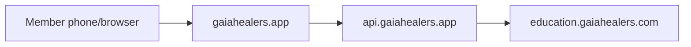

# Gaia Healers App Domain Setup (`gaiahealers.app`)

This guide connects **gaiahealers.app** (apex — no `app.` subdomain) to the mobile web app in this repo.

## Architecture

| URL | Role | Host |
| --- | --- | --- |
| `https://gaiahealers.app` | Mobile web app (this repo) | GitHub Pages |
| `https://api.gaiahealers.app` | Backend API proxy (GHL, voice, auth) | Your server (today: same host as `ba2ki.com/gaia-proxy`) |
| `https://education.gaiahealers.com` | GHL member portal (courses, login) | GoHighLevel |
| `https://crm.gaiahealers.com` | GHL CRM + embedded app menu | GoHighLevel |
| `https://gaiahealers.com` | Public marketing site | Existing site |



---

## Phase 1 — Connect gaiahealers.app (Squarespace)

### Step 1: GitHub Pages custom domain

The repo `CNAME` file contains `gaiahealers.app`.

1. Open GitHub → **gaiagitshare/gaia-healers-mobile-app** → **Settings** → **Pages**.
2. Under **Custom domain**, enter: `gaiahealers.app`
3. Wait for DNS check, then enable **Enforce HTTPS**.

### Step 2: Squarespace DNS (apex A records)

Squarespace cannot use a CNAME on the root (`@`). GitHub Pages apex domains use **four A records**.

1. Log in at [squarespace.com](https://www.squarespace.com) → **Settings** → **Domains**.
2. Click **gaiahealers.app** → **DNS Settings**.

**Remove** any existing **A** records on `@` that point to Squarespace parking (if the domain is not hosting a Squarespace site).

**Add four A records** (same Host, different IPs):

| Type | Host | IP address |
| --- | --- | --- |
| `A` | `@` | `185.199.108.153` |
| `A` | `@` | `185.199.109.153` |
| `A` | `@` | `185.199.110.153` |
| `A` | `@` | `185.199.111.153` |

**Optional — www redirect:** GitHub can redirect `www` → apex if you also add:

| Type | Host | Alias Data |
| --- | --- | --- |
| `CNAME` | `www` | `gaiagitshare.github.io` |

Then add `www.gaiahealers.app` in GitHub Pages if prompted, or let GitHub auto-redirect.

**Do not delete** MX / SPF / DKIM records if you use email on this domain.

DNS can take 15 minutes to 48 hours. Test:

```bash
dig A gaiahealers.app +short
curl -I https://gaiahealers.app/home.html
```

Expected: four GitHub IPs above, then HTTP 200 from the app.

### Step 3: Allow the new origin on the API proxy

On the server that runs `staging-proxy/` (currently `ba2ki.com`), update environment variables and restart:

```env
APP_PUBLIC_URL=https://gaiahealers.app/home.html
PROXY_PUBLIC_URL=https://api.gaiahealers.app
ALLOWED_ORIGINS=https://gaiahealers.app,https://www.gaiahealers.app,https://gaiagitshare.github.io,https://gaiagitshare.github.io/gaia-healers-mobile-app,https://crm.gaiahealers.com
```

Until `api.gaiahealers.app` is live, the app **automatically falls back** to `https://ba2ki.com/gaia-proxy`.

### Step 4: API subdomain (optional, recommended)

| Type | Host | Alias Data |
| --- | --- | --- |
| `CNAME` | `api` | `ba2ki.com` |

Configure TLS on your server so `https://api.gaiahealers.app` serves the proxy routes.

Verify:

```bash
curl https://api.gaiahealers.app/health
```

### Step 5: Update GHL embed

Use the snippet in [`ghl/custom-html-iframe.html`](../ghl/custom-html-iframe.html) — it points to `https://gaiahealers.app/home.html`.

---

## Phase 2 — Installable web app (PWA)

Already in the repo:

- `manifest.webmanifest` — Add to Home Screen on iPhone/Android
- Apple web app meta tags on `home.html`
- `apple-touch-icon` using `assets/gaia-logo.png`

Members: **Safari → Share → Add to Home Screen**.

---

## Phase 3 — Native iPhone & Android (later)

Wrap this same codebase with **Capacitor**. Native apps use the same `https://gaiahealers.app` UI and `https://api.gaiahealers.app` backend.

---

## Checklist

- [ ] GitHub Pages custom domain = `gaiahealers.app`
- [ ] Squarespace: four A records on `@` → GitHub IPs
- [ ] HTTPS enabled on GitHub Pages
- [ ] Proxy `ALLOWED_ORIGINS` includes `https://gaiahealers.app`
- [ ] `curl -I https://gaiahealers.app/home.html` returns OK
- [ ] GHL embed updated
- [ ] Test on iPhone: app, login, Gaia Assist voice

---

## Troubleshooting

| Symptom | Fix |
| --- | --- |
| GitHub DNS check fails | Remove conflicting Squarespace A records on `@`; wait for propagation |
| App loads but no live data | Add `https://gaiahealers.app` to proxy `ALLOWED_ORIGINS` |
| SSL certificate pending | Wait up to 24h after DNS is correct; re-save custom domain in GitHub |
| Voice/mic blocked in GHL iframe | Open `https://gaiahealers.app` in Safari directly |

---

## Related docs

- [`STAGING-PROXY.md`](STAGING-PROXY.md) — API env vars and routes
- [`GHL-COMMUNITY-SYNC.md`](GHL-COMMUNITY-SYNC.md) — portal + community wiring
